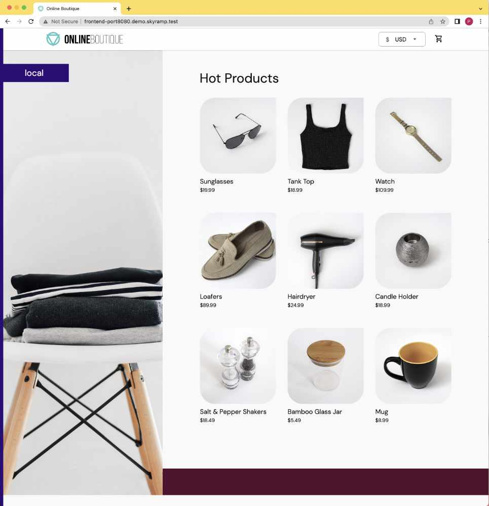

# Skyramp sample microservices
Based on GCP **Online Boutique** with added rest and thrift transport protocols.

## Getting Started

### Install pre-requisite tools
- docker
- jq
- curl
- kubectl


## Copy code for sample services
```
git clone https://github.com/letsramp/sample-services.git
cd sample-services/src
```

## Optional - Building sample services from source
```
make build-services
```
### Push services to container registry
```
make push-services
```

## Use skyramp to create a local kubernetes cluster
```
skyramp config local apply
```

Expected result
```
$ skyramp config apply local
│Creating local cluster. ∙∙∙ [##########################################....................] 68 %
```

## Use skyramp to deploy Skyramp Sample Services
Sample skyramp project directores are located under the skyramp directory.

### Updating DNS with ingress FQDN

Copy the following command and paste to a terminal to update /etc/host with ingress FQDN
```
sudo bash -c 'cat >> /etc/hosts'<<EOF
#--- Added by Skyramp Sample Services
127.0.0.1 cart-service-port50000.demo.skyramp.test
127.0.0.1 cart-service-port60000.demo.skyramp.test
127.0.0.1 checkout-service-port50000.demo.skyramp.test
127.0.0.1 checkout-service-port60000.demo.skyramp.test
127.0.0.1 currency-service-port60000.demo.skyramp.test
127.0.0.1 email-service-port60000.demo.skyramp.test
127.0.0.1 email-service-port50000.demo.skyramp.test
127.0.0.1 frontend-port8080.demo.skyramp.test
127.0.0.1 payment-service-port60000.demo.skyramp.test
127.0.0.1 payment-service-port50000.demo.skyramp.test
127.0.0.1 product-catalog-service-port50000.demo.skyramp.test
127.0.0.1 product-catalog-service-port60000.demo.skyramp.test
127.0.0.1 recommendation-service-port50000.demo.skyramp.test
127.0.0.1 recommendation-service-port60000.demo.skyramp.test
127.0.0.1 shipping-service-port50000.demo.skyramp.test
127.0.0.1 shipping-service-port60000.demo.skyramp.test
#--- end Skyramp Sample Services
EOF

```


### Testing services with gRPC
```
cd skyramp/grpc

$ skyramp up demo
```

Example Result:
```
skyramp up demo
email-service-db4c8f558-2sc7q                 ready
recommendation-service-5b95597bc-w68gt        ready
shipping-service-bfccbdfd7-9dqqg              ready
currency-service-b9cb57446-2d4lf              ready
frontend-5b6d788d47-qscgf                     ready
redis-7f6445f856-6sp89                        ready
payment-service-78f9576cd7-662cd              ready
product-catalog-service-6bdb96c889-8ws8j      ready
ad-service-5b56d86b5f-qxbk7                   ready
cart-service-68fc59dc8c-v56kp                 ready
checkout-service-6dcc7c5ff7-2hf9k             ready
skyramp-debug-worker-654cd9fc6c-f75bd         ready
All pods are ready.
```

## Explore the services with kubectl

Set config for kubectl
```
export KUBECONFIG=~/.skyramp/workload-config
```

List namespaces
```
kubectl get ns
```

example results
```
NAME                                  STATUS   AGE
default                               Active   78m
kube-node-lease                       Active   78m
kube-public                           Active   78m
kube-system                           Active   78m
local-path-storage                    Active   77m
projectcontour                        Active   77m
skyramp-client-skyramp-project-demo   Active   71m
```

List pods
```
kubectl get pods -n skyramp-client-skyramp-project-demo
```

Example result
```
NAME                                       READY   STATUS    RESTARTS   AGE
ad-service-5b56d86b5f-qxbk7                1/1     Running   0          133m
cart-service-68fc59dc8c-v56kp              1/1     Running   0          133m
checkout-service-6dcc7c5ff7-2hf9k          1/1     Running   0          133m
currency-service-b9cb57446-2d4lf           1/1     Running   0          133m
email-service-db4c8f558-2sc7q              1/1     Running   0          133m
frontend-5b6d788d47-qscgf                  1/1     Running   0          133m
payment-service-78f9576cd7-662cd           1/1     Running   0          133m
product-catalog-service-6bdb96c889-8ws8j   1/1     Running   0          133m
recommendation-service-5b95597bc-w68gt     1/1     Running   0          133m
redis-7f6445f856-6sp89                     1/1     Running   0          133m
shipping-service-bfccbdfd7-9dqqg           1/1     Running   0          133m
skyramp-debug-worker-654cd9fc6c-f75bd      1/1     Running   0          133m

```

Open a browser and navigate to http://frontend-port8080.demo.skyramp.test

<br/><br/>

<br/><br/>

Explore the Online Butique with products, shopping carts and checkout.


## Testing services with gRPC golang client

```
cd skyramp/grpc/sample-clients/golang
```

Add items to cart
```
go run ./cmd/cart
```
Expected result
```
"Successfully added the item to the cart."
```

Checkout order
```
go run ./cmd/order
```

Example result
```
Order result:  order_id:"f2c18212-339a-11ed-b801-2eb35b3bc06f" shipping_tracking_id:"WE-34945-178180794" shipping_cost:{currency_code:"USD" units:8 nanos:990000000} shipping_address:{street_address:"1600 Amp street" city:"Mountain View" state:"CA" country:"USA" zip_code:94043} items:{item:{product_id:"OLJCESPC7Z" quantity:1} cost:{currency_code:"USD" units:19 nanos:990000000}}
```


## Testing services with thrift

Change the working directory to the project folder for thrift
```
cd skyramp/thrift
```

Open and inspect the thrift API (demo.thrift) in the thrift folder of skyramp project.

Bring up the demo target
```
skyramp up demo
```

Example result
```
product-catalog-service-589f4f7565-dbhc5      ready
redis-7f6445f856-96pch                        ready
currency-service-69dbcd889d-45nk7             ready
email-service-db4c8f558-p5gnt                 ready
recommendation-service-7fb4598577-gw9vl       ready
checkout-service-7497b6d6df-5p96s             ready
skyramp-mock-worker-847bfcb5f6-nbb5x          ready
cart-service-68fc59dc8c-mgqzt                 ready
payment-service-568974bcd9-fgl5b              ready
shipping-service-554b6c8757-vpwgk             ready
```

Change directory to the thrift clients
```
cd sample-client/golang
```

### Example: List products
```
go run ./cmd/product

```

Example result
```
Sucessfully Connected to Product Catalog Server
Trying to get product with id[OLJCESPC7Z]
Result:
{
        "id": "OLJCESPC7Z",
        "name": "Sunglasses",
        "description": "Add a modern touch to your outfits with these sleek aviator sunglasses.",
        "picture": "/static/img/products/sunglasses.jpg",
        "price_usd": {
                "currency_code": "USD",
                "units": 19,
                "nanos": 990000000
        },
        "categories": [
                "accessories"
        ]
}

Trying to get all products
Result:
[
    {
        "id": "OLJCESPC7Z",
        "name": "Sunglasses",
        "description": "Add a modern touch to your outfits with these sleek aviator sunglasses.",
        "picture": "/static/img/products/sunglasses.jpg",
        "price_usd": {
                "currency_code": "USD",
                "units": 19,
                "nanos": 990000000
        },
        "categories": [
                "accessories"
        ]
    },
    ...
    {
        "id": "9SIQT8TOJO",
        "name": "Bamboo Glass Jar",
        "description": "This bamboo glass jar can hold 57 oz (1.7 l) and is perfect for any kitchen.",
        "picture": "/static/img/products/bamboo-glass-jar.jpg",
        "price_usd": {
                "currency_code": "USD",
                "units": 5,
                "nanos": 490000000
        },
        "categories": [
                "kitchen"
        ]
    },
    {
        "id": "6E92ZMYYFZ",
        "name": "Mug",
        "description": "A simple mug with a mustard interior.",
        "picture": "/static/img/products/mug.jpg",
        "price_usd": {
                "currency_code": "USD",
                "units": 8,
                "nanos": 990000000
        },
        "categories": [
                "kitchen"
        ]
    }
]
```

### Example: Add product to cart
Scenario ./cmd/cart/main.go demonstrates the API to add products to cart

```
go run ./cmd/cart

```

Example result
```
Connected to Cart Service
Adding product OLJCESPC7Z to Cart

Get Cart
{
    "user_id": "abcde",
    "items": [
        {
            "product_id": "OLJCESPC7Z",
            "quantity": 5
        }
    ]
}
```


### Example: Add products to cart and perform checkout
Inspect source code
```
cmd/checkout/main.go
```

Executing scenario
```
go run ./cmd/checkout
```

Example result
```
Sucessfully connected to Cart Service
Successfully added [4] units of product [OLJCESPC7Z] to Cart
Successfully connected to Checkout Service
Order Result Received fromm Checkout
{
        "order_id": "28f1f872-eac3-46b4-ab81-f7d294bbf528",
        "shipping_tracking_id": "b98eabc9-95ef-48ee-ab7d-d80a9aad8b05",
        "shipping_cost": {
                "currency_code": "USD",
                "units": 10,
                "nanos": 100
        },
        "shipping_address": {
                "street_address": "1600 Amp street",
                "city": "Mountain View",
                "state": "CA",
                "country": "USA",
                "zip_code": 94043
        },
        "items": [
                {
                        "item": {
                                "product_id": "OLJCESPC7Z",
                                "quantity": 16
                        },
                        "cost": {
                                "currency_code": "USD",
                                "units": 19,
                                "nanos": 990000000
                        }
                }
        ]
}
```


## Testing services with REST

Change the working directory to the project folder for thrift
```
cd <repo>/skyramp/rest
```

Bring up the demo target
```
skyramp up demo
```

Example result
```
product-catalog-service-589f4f7565-dbhc5      ready
redis-7f6445f856-96pch                        ready
currency-service-69dbcd889d-45nk7             ready
email-service-db4c8f558-p5gnt                 ready
recommendation-service-7fb4598577-gw9vl       ready
checkout-service-7497b6d6df-5p96s             ready
skyramp-mock-worker-847bfcb5f6-nbb5x          ready
cart-service-68fc59dc8c-mgqzt                 ready
payment-service-568974bcd9-fgl5b              ready
shipping-service-554b6c8757-vpwgk             ready
```

Change directory to the REST clients
```
cd sample-client/curl
```

### cartservice operation

**Add product to shopping cart**
```
curl -X 'POST' 'http://cart-service-port60000.demo.skyramp.test/cart/abcde' \
  --resolve cart-service-port60000.demo.skyramp.test:80:127.0.0.1 \
  -H 'accept: application/json' \
  -H 'content-type: application/json' \
  -d '{
  "product_id": "ls4psxunum",
  "quantity": 8
}'
```

Example result
```
{"success":"200 OK"}
```

**Get shopping cart**
```
curl -X 'GET' \
  'http://cart-service-port60000.demo.skyramp.test/cart/abcde' \
   --resolve cart-service-port60000.demo.skyramp.test:80:127.0.0.1 \
   -H 'accept: application/json' | jq .
```

Example result
```
{
  "user_id": "abcde",
  "items": [
    {
      "product_id": "LS4PSXUNUM",
      "quantity": 8
    }
  ]
}
```


**Delete shopping cart**
```
curl -X 'DELETE' \
  'http://cart-service-port60000.demo.skyramp.test/cart/abcde' \
   --resolve cart-service-port60000.demo.skyramp.test:80:127.0.0.1 \
   -H 'accept: application/json'
```

Example result
```
{"success":"200 OK"}
```

## Product Catalog Service

### Get products
```
curl -X 'GET' \
  'http://product-catalog-service-port60000.demo.skyramp.test/get-products' \
  --resolve product-catalog-service-port60000.demo.skyramp.test:80:127.0.0.1 \
  -H 'accept: application/json' | jq .
```

Example result
```
[
  {
    "id": "OLJCESPC7Z",
    "name": "Sunglasses",
    "description": "Add a modern touch to your outfits with these sleek aviator sunglasses.",
    "picture": "/static/img/products/sunglasses.jpg",
    "priceUsd": {
      "currencyCode": "USD",
      "units": 19,
      "nanos": 990000000
    },
    "categories": [
      "accessories"
    ]
  },
  {
    "id": "66VCHSJNUP",
    "name": "Tank Top",
    "description": "Perfectly cropped cotton tank, with a scooped neckline.",
    "picture": "/static/img/products/tank-top.jpg",
    "priceUsd": {
      "currencyCode": "USD",
      "units": 18,
      "nanos": 990000000
    },
    "categories": [
      "clothing",
      "tops"
    ]
  },
  {
    "id": "1YMWWN1N4O",
    "name": "Watch",
    "description": "This gold-tone stainless steel watch will work with most of your outfits.",
    "picture": "/static/img/products/watch.jpg",
    "priceUsd": {
      "currencyCode": "USD",
      "units": 109,
      "nanos": 990000000
    },
    "categories": [
      "accessories"
    ]
  },
  {
    "id": "L9ECAV7KIM",
    "name": "Loafers",
    "description": "A neat addition to your summer wardrobe.",
    "picture": "/static/img/products/loafers.jpg",
    "priceUsd": {
      "currencyCode": "USD",
      "units": 89,
      "nanos": 990000000
    },
    "categories": [
      "footwear"
    ]
  },
  {
    "id": "2ZYFJ3GM2N",
    "name": "Hairdryer",
    "description": "This lightweight hairdryer has 3 heat and speed settings. It's perfect for travel.",
    "picture": "/static/img/products/hairdryer.jpg",
    "priceUsd": {
      "currencyCode": "USD",
      "units": 24,
      "nanos": 990000000
    },
    "categories": [
      "hair",
      "beauty"
    ]
  },
  {
    "id": "0PUK6V6EV0",
    "name": "Candle Holder",
    "description": "This small but intricate candle holder is an excellent gift.",
    "picture": "/static/img/products/candle-holder.jpg",
    "priceUsd": {
      "currencyCode": "USD",
      "units": 18,
      "nanos": 990000000
    },
    "categories": [
      "decor",
      "home"
    ]
  },
  {
    "id": "LS4PSXUNUM",
    "name": "Salt & Pepper Shakers",
    "description": "Add some flavor to your kitchen.",
    "picture": "/static/img/products/salt-and-pepper-shakers.jpg",
    "priceUsd": {
      "currencyCode": "USD",
      "units": 18,
      "nanos": 490000000
    },
    "categories": [
      "kitchen"
    ]
  },
  {
    "id": "9SIQT8TOJO",
    "name": "Bamboo Glass Jar",
    "description": "This bamboo glass jar can hold 57 oz (1.7 l) and is perfect for any kitchen.",
    "picture": "/static/img/products/bamboo-glass-jar.jpg",
    "priceUsd": {
      "currencyCode": "USD",
      "units": 5,
      "nanos": 490000000
    },
    "categories": [
      "kitchen"
    ]
  },
  {
    "id": "6E92ZMYYFZ",
    "name": "Mug",
    "description": "A simple mug with a mustard interior.",
    "picture": "/static/img/products/mug.jpg",
    "priceUsd": {
      "currencyCode": "USD",
      "units": 8,
      "nanos": 990000000
    },
    "categories": [
      "kitchen"
    ]
  }
]
```

### Get product
```
curl -X 'GET' \
  'http://product-catalog-service-port60000.demo.skyramp.test/get-product?product_id=OLJCESPC7Z' \
    --resolve product-catalog-service-port60000.demo.skyramp.test:80:127.0.0.1 \
  -H 'accept: application/json' | jq .
```

Example result
```
{
  "id": "OLJCESPC7Z",
  "name": "Sunglasses",
  "description": "Add a modern touch to your outfits with these sleek aviator sunglasses.",
  "picture": "/static/img/products/sunglasses.jpg",
  "priceUsd": {
    "currencyCode": "USD",
    "units": 19,
    "nanos": 990000000
  },
  "categories": [
    "accessories"
  ]
}
```

### Search product
```
curl -X 'GET' \
  'http://product-catalog-service-port60000.demo.skyramp.test/search-products?query=kitchen' \
    --resolve product-catalog-service-port60000.demo.skyramp.test:80:127.0.0.1 \
  -H 'accept: application/json' | jq .
```

Example result
```
[
  {
    "id": "LS4PSXUNUM",
    "name": "Salt & Pepper Shakers",
    "description": "Add some flavor to your kitchen.",
    "picture": "/static/img/products/salt-and-pepper-shakers.jpg",
    "priceUsd": {
      "currencyCode": "USD",
      "units": 18,
      "nanos": 490000000
    },
    "categories": [
      "kitchen"
    ]
  },
  {
    "id": "9SIQT8TOJO",
    "name": "Bamboo Glass Jar",
    "description": "This bamboo glass jar can hold 57 oz (1.7 l) and is perfect for any kitchen.",
    "picture": "/static/img/products/bamboo-glass-jar.jpg",
    "priceUsd": {
      "currencyCode": "USD",
      "units": 5,
      "nanos": 490000000
    },
    "categories": [
      "kitchen"
    ]
  }
]
```

## Checkout service
**Checkout order**
```
curl -X 'POST' \
  'http://checkout-service-port60000.demo.skyramp.test/checkout' \
  --resolve checkout-service-port60000.demo.skyramp.test:80:127.0.0.1 \
  -H 'accept: application/json' \
  -H 'Content-Type: application/json' \
  -d '{
  "user_id": "abcde",
  "user_currency": "UDS",
  "address": {
    "street_address": "1600 Amp street",
    "city": "Mountain View",
    "state": "CA",
    "country": "USA",
    "zip_code": "94043"
  },
  "email": "someone@example.com",
  "credit_card": {
    "credit_card_number": "4432-8015-6251-0454",
    "credit_card_cvv": 672,
    "credit_card_expiration_year": 24,
    "credit_card_expiration_month": 1
  }
}' | jq .

```

Example result
```
{
  "order_id": "99ec9ebd-13fc-411d-8997-075d9a5cdb9d",
  "shipping_tracking_id": "85f19309-cdd6-4b42-abba-42f9d8d1bd60",
  "shipping_cost": {
    "currency_code": "USD",
    "units": 10,
    "nanos": 100
  },
  "shipping_address": {
    "street_address": "1600 Amp street",
    "city": "Mountain View",
    "state": "CA",
    "country": "USA",
    "zip_code": "94043"
  },
  "items": [
    {
      "item": {
        "product_id": "LS4PSXUNUM",
        "quantity": 8
      }
    }
  ]
}
`
```
## Recommendation service

**List recommendation**
```
curl -X 'GET' \
  'http://recommendation-service-port60000.demo.skyramp.test/list-recommendations?product_id=LS4PSXUNUM%22' \
  -H 'accept: application/json'
```

Example result
```
[
  "2ZYFJ3GM2N",
  "OLJCESPC7Z",
  "LS4PSXUNUM",
  "9SIQT8TOJO",
  "66VCHSJNUP"
]
```

## Email service
**Send order confirmation**
```
curl -X 'POST' \
  'http://email-service-port60000.demo.skyramp.test/send-order-confirmation' \
   --resolve email-service-port60000.demo.skyramp.test:80:127.0.0.1 \
  -H 'accept: application/json' \
  -H 'Content-Type: application/json' \
  -d '{
  "email": "someone@example.com",
  "order": {
    "order_id": "99ec9ebd-13fc-411d-8997-075d9a5cdb9d",
    "shipping_tracking_id": "85f19309-cdd6-4b42-abba-42f9d8d1bd60",
    "shipping_cost": {
      "currency_code": "USD",
      "units": 10,
      "nanos": 900
    },
    "shipping_address": {
      "street_address": "1600 Amp street",
      "city": "Mountain View",
      "state": "CA",
      "country": "USA",
      "zip_code": "94043"
    },
    "items": [
      {
        "item": {
          "product_id": "L9ECAV7KIM",
          "quantity": 2
        },
        "cost": {
          "currency_code": "USD",
          "units": 89,
          "nanos": 990000000
        }
      },
      {
        "item": {
          "product_id": "2ZYFJ3GM2N",
          "quantity": 1
        },
        "cost": {
          "currency_code": "USD",
          "units": 24,
          "nanos": 990000000
        }
      }
    ]
  }
}
'
```

Example result
```
{
  "status":"200 OK"
}
```

## Payment service
```
curl -X 'POST' \
  'http://payment-service-port60000.demo.skyramp.test/charge' \
  --resolve payment-service-port60000.demo.skyramp.test:80:127.0.0.1 \
  -H 'accept: application/json' \
  -H 'Content-Type: application/json' \
  -d '{
  "amount": {
    "currency_code": "USD",
    "units": 245,
    "nanos": 9900000
  },
  "credit_card": {
    "credit_card_number": "4432-8015-6152-0454",
    "credit_card_cvv": 672,
    "credit_card_expiration_year": 2024,
    "credit_card_expiration_month": 1
  }
}'
```

Example result
```
{
  "transaction_id":"7c542c3a-372f-4b9f-b6c8-f8876a9f86d3"
}
```

## Shipping service
**Get quote**
```
curl -X 'PUT' \
  'http://shipping-service-port60000.demo.skyramp.test/get-quote' \
    --resolve shipping-service-port60000.demo.skyramp.test:80:127.0.0.1 \
  -H 'accept: application/json' \
  -H 'Content-Type: application/json' \
  -d '{
  "address": {
    "street_address": "1600 Amp street",
    "city": "Mountain View",
    "state": "CA",
    "country": "USA",
    "zip_code": "94043"
  },
  "items": [
    {
        "product_id": "L9ECAV7KIM",
        "quantity": 2
    },
    {
        "product_id": "2ZYFJ3GM2N",
        "quantity": 1
    }
  ]
}' | jq .

```

Expected result
```
{
  "cost_usd": {
    "currency_code": "USD",
    "units": 8,
    "nanos": 990000000
  }
}
```

**Ship order**
```
curl -X 'PUT' \
  'http://shipping-service-port60000.demo.skyramp.test/ship-order' \
  --resolve shipping-service-port60000.demo.skyramp.test:80:127.0.0.1 \
  -H 'accept: application/json' \
  -H 'Content-Type: application/json' \
  -d '{
  "address": {
    "street_address": "1600 Amp street",
    "city": "Mountain View",
    "state": "CA",
    "country": "USA",
    "zip_code": "94043"
  },
  "items": [
    {
        "product_id": "L9ECAV7KIM",
        "quantity": 2
    },
    {
        "product_id": "2ZYFJ3GM2N",
        "quantity": 1
    }
  ]
}' | jq .

```

Expected result
```
{
  "tracking_id": "NS-34988-173225515"
}

```

# OpenAPI
```
{
  "openapi": "3.0.2",
  "info": {
    "title": "Skyramp Sample Microservices",
    "version": "0.0.1"
  },
  "paths": {
    "/get-ad": {
      "get": {
        "tags": [
          "ad"
        ],
        "summary": "Get Ad",
        "operationId": "get_ad_get_ad_get",
        "parameters": [
          {
            "required": false,
            "schema": {
              "title": "Category",
              "type": "array",
              "items": {
                "type": "string"
              }
            },
            "name": "category",
            "in": "query"
          }
        ],
        "responses": {
          "200": {
            "description": "Successful Response",
            "content": {
              "application/json": {
                "schema": {
                  "title": "Response Get Ad Get Ad Get",
                  "type": "array",
                  "items": {
                    "$ref": "#/components/schemas/Ad"
                  }
                }
              }
            }
          },
          "422": {
            "description": "Validation Error",
            "content": {
              "application/json": {
                "schema": {
                  "$ref": "#/components/schemas/HTTPValidationError"
                }
              }
            }
          }
        }
      }
    },
    "/cart/{user_id}": {
      "get": {
        "tags": [
          "cart"
        ],
        "summary": "Get Cart",
        "operationId": "get_cart_cart__user_id__get",
        "parameters": [
          {
            "required": true,
            "schema": {
              "title": "User Id",
              "type": "string"
            },
            "name": "user_id",
            "in": "path"
          }
        ],
        "responses": {
          "200": {
            "description": "Successful Response",
            "content": {
              "application/json": {
                "schema": {
                  "title": "Response Get Cart Cart  User Id  Get",
                  "type": "array",
                  "items": {
                    "$ref": "#/components/schemas/Cart"
                  }
                }
              }
            }
          },
          "422": {
            "description": "Validation Error",
            "content": {
              "application/json": {
                "schema": {
                  "$ref": "#/components/schemas/HTTPValidationError"
                }
              }
            }
          }
        }
      },
      "post": {
        "tags": [
          "cart"
        ],
        "summary": "Add To Cart",
        "operationId": "add_to_cart_cart__user_id__post",
        "parameters": [
          {
            "required": true,
            "schema": {
              "title": "User Id",
              "type": "string"
            },
            "name": "user_id",
            "in": "path"
          }
        ],
        "requestBody": {
          "content": {
            "application/json": {
              "schema": {
                "$ref": "#/components/schemas/Cart"
              }
            }
          },
          "required": true
        },
        "responses": {
          "200": {
            "description": "Successful Response",
            "content": {
              "application/json": {
                "schema": {}
              }
            }
          },
          "422": {
            "description": "Validation Error",
            "content": {
              "application/json": {
                "schema": {
                  "$ref": "#/components/schemas/HTTPValidationError"
                }
              }
            }
          }
        }
      },
      "delete": {
        "tags": [
          "cart"
        ],
        "summary": "Delete Cart",
        "operationId": "delete_cart_cart__user_id__delete",
        "parameters": [
          {
            "required": true,
            "schema": {
              "title": "User Id",
              "type": "string"
            },
            "name": "user_id",
            "in": "path"
          }
        ],
        "responses": {
          "200": {
            "description": "Successful Response",
            "content": {
              "application/json": {
                "schema": {}
              }
            }
          },
          "422": {
            "description": "Validation Error",
            "content": {
              "application/json": {
                "schema": {
                  "$ref": "#/components/schemas/HTTPValidationError"
                }
              }
            }
          }
        }
      }
    },
    "/checkout/": {
      "post": {
        "tags": [
          "checkout"
        ],
        "summary": "Checkout Order",
        "operationId": "checkout_order_checkout__post",
        "requestBody": {
          "content": {
            "application/json": {
              "schema": {
                "$ref": "#/components/schemas/Order"
              }
            }
          },
          "required": true
        },
        "responses": {
          "200": {
            "description": "Successful Response",
            "content": {
              "application/json": {
                "schema": {
                  "$ref": "#/components/schemas/OrderResult"
                }
              }
            }
          },
          "422": {
            "description": "Validation Error",
            "content": {
              "application/json": {
                "schema": {
                  "$ref": "#/components/schemas/HTTPValidationError"
                }
              }
            }
          }
        }
      }
    },
    "/send-order-confirmation": {
      "post": {
        "tags": [
          "confirmation"
        ],
        "summary": "Send Order Confirmation",
        "operationId": "send_order_confirmation_send_order_confirmation_post",
        "requestBody": {
          "content": {
            "application/json": {
              "schema": {
                "$ref": "#/components/schemas/OrderConfirmation"
              }
            }
          },
          "required": true
        },
        "responses": {
          "200": {
            "description": "Successful Response",
            "content": {
              "application/json": {
                "schema": {}
              }
            }
          },
          "422": {
            "description": "Validation Error",
            "content": {
              "application/json": {
                "schema": {
                  "$ref": "#/components/schemas/HTTPValidationError"
                }
              }
            }
          }
        }
      }
    },
    "/charge": {
      "put": {
        "tags": [
          "payment"
        ],
        "summary": "Charge",
        "operationId": "charge_charge_put",
        "requestBody": {
          "content": {
            "application/json": {
              "schema": {
                "$ref": "#/components/schemas/Payment"
              }
            }
          },
          "required": true
        },
        "responses": {
          "200": {
            "description": "Successful Response",
            "content": {
              "application/json": {
                "schema": {
                  "$ref": "#/components/schemas/PaymentResponse"
                }
              }
            }
          },
          "422": {
            "description": "Validation Error",
            "content": {
              "application/json": {
                "schema": {
                  "$ref": "#/components/schemas/HTTPValidationError"
                }
              }
            }
          }
        }
      }
    },
    "/get-quote": {
      "put": {
        "tags": [
          "shipping"
        ],
        "summary": "Get Shipping Quote",
        "operationId": "get_shipping_quote_get_quote_put",
        "requestBody": {
          "content": {
            "application/json": {
              "schema": {
                "$ref": "#/components/schemas/GetQuoteRequest"
              }
            }
          },
          "required": true
        },
        "responses": {
          "200": {
            "description": "Successful Response",
            "content": {
              "application/json": {
                "schema": {
                  "$ref": "#/components/schemas/ShippingQuote"
                }
              }
            }
          },
          "422": {
            "description": "Validation Error",
            "content": {
              "application/json": {
                "schema": {
                  "$ref": "#/components/schemas/HTTPValidationError"
                }
              }
            }
          }
        }
      }
    },
    "/ship-order": {
      "put": {
        "tags": [
          "shipping"
        ],
        "summary": "Ship Order",
        "operationId": "ship_order_ship_order_put",
        "requestBody": {
          "content": {
            "application/json": {
              "schema": {
                "$ref": "#/components/schemas/ShipOrderRequest"
              }
            }
          },
          "required": true
        },
        "responses": {
          "200": {
            "description": "Successful Response",
            "content": {
              "application/json": {
                "schema": {
                  "$ref": "#/components/schemas/ShipOrderResponse"
                }
              }
            }
          },
          "422": {
            "description": "Validation Error",
            "content": {
              "application/json": {
                "schema": {
                  "$ref": "#/components/schemas/HTTPValidationError"
                }
              }
            }
          }
        }
      }
    },
    "/list-recommendation": {
      "get": {
        "tags": [
          "recommendation"
        ],
        "summary": "Listrecommendations",
        "operationId": "listRecommendations_list_recommendation_get",
        "parameters": [
          {
            "required": false,
            "schema": {
              "title": "Product Id",
              "type": "array",
              "items": {
                "type": "string"
              }
            },
            "name": "product_id",
            "in": "query"
          }
        ],
        "responses": {
          "200": {
            "description": "Successful Response",
            "content": {
              "application/json": {
                "schema": {
                  "$ref": "#/components/schemas/RecommendationResponse"
                }
              }
            }
          },
          "422": {
            "description": "Validation Error",
            "content": {
              "application/json": {
                "schema": {
                  "$ref": "#/components/schemas/HTTPValidationError"
                }
              }
            }
          }
        }
      }
    },
    "/get-product": {
      "get": {
        "tags": [
          "productcatalog"
        ],
        "summary": "Get Product",
        "operationId": "get_product_get_product_get",
        "parameters": [
          {
            "required": true,
            "schema": {
              "title": "Product Id",
              "type": "string"
            },
            "name": "product_id",
            "in": "query"
          }
        ],
        "responses": {
          "200": {
            "description": "Successful Response",
            "content": {
              "application/json": {
                "schema": {
                  "$ref": "#/components/schemas/Product"
                }
              }
            }
          },
          "422": {
            "description": "Validation Error",
            "content": {
              "application/json": {
                "schema": {
                  "$ref": "#/components/schemas/HTTPValidationError"
                }
              }
            }
          }
        }
      }
    },
    "/get-products": {
      "get": {
        "tags": [
          "productcatalog"
        ],
        "summary": "Get Products",
        "operationId": "get_products_get_products_get",
        "responses": {
          "200": {
            "description": "Successful Response",
            "content": {
              "application/json": {
                "schema": {
                  "title": "Response Get Products Get Products Get",
                  "type": "array",
                  "items": {
                    "$ref": "#/components/schemas/Product"
                  }
                }
              }
            }
          }
        }
      }
    },
    "/search-product": {
      "get": {
        "tags": [
          "productcatalog"
        ],
        "summary": "Search Product",
        "operationId": "search_product_search_product_get",
        "parameters": [
          {
            "required": true,
            "schema": {
              "title": "Query",
              "type": "string"
            },
            "name": "query",
            "in": "query"
          }
        ],
        "responses": {
          "200": {
            "description": "Successful Response",
            "content": {
              "application/json": {
                "schema": {
                  "title": "Response Search Product Search Product Get",
                  "type": "array",
                  "items": {
                    "$ref": "#/components/schemas/Product"
                  }
                }
              }
            }
          },
          "422": {
            "description": "Validation Error",
            "content": {
              "application/json": {
                "schema": {
                  "$ref": "#/components/schemas/HTTPValidationError"
                }
              }
            }
          }
        }
      }
    }
  },
  "components": {
    "schemas": {
      "Ad": {
        "title": "Ad",
        "required": [
          "redirect_url",
          "text"
        ],
        "type": "object",
        "properties": {
          "redirect_url": {
            "title": "Redirect Url",
            "type": "string"
          },
          "text": {
            "title": "Text",
            "type": "string"
          }
        }
      },
      "Address": {
        "title": "Address",
        "required": [
          "street_address",
          "city",
          "state",
          "country",
          "zip_code"
        ],
        "type": "object",
        "properties": {
          "street_address": {
            "title": "Street Address",
            "type": "string"
          },
          "city": {
            "title": "City",
            "type": "string"
          },
          "state": {
            "title": "State",
            "type": "string"
          },
          "country": {
            "title": "Country",
            "type": "string"
          },
          "zip_code": {
            "title": "Zip Code",
            "type": "string"
          }
        }
      },
      "Cart": {
        "title": "Cart",
        "required": [
          "user_id",
          "items"
        ],
        "type": "object",
        "properties": {
          "user_id": {
            "title": "User Id",
            "type": "string"
          },
          "items": {
            "title": "Items",
            "type": "array",
            "items": {
              "$ref": "#/components/schemas/CartItem"
            }
          }
        }
      },
      "CartItem": {
        "title": "CartItem",
        "required": [
          "product_id",
          "quantity"
        ],
        "type": "object",
        "properties": {
          "product_id": {
            "title": "Product Id",
            "type": "string"
          },
          "quantity": {
            "title": "Quantity",
            "type": "integer"
          }
        }
      },
      "CreditCardInfo": {
        "title": "CreditCardInfo",
        "required": [
          "credit_card_number",
          "credit_card_cvv",
          "credit_card_expiration_year",
          "credit_card_expiration_month"
        ],
        "type": "object",
        "properties": {
          "credit_card_number": {
            "title": "Credit Card Number",
            "type": "string"
          },
          "credit_card_cvv": {
            "title": "Credit Card Cvv",
            "type": "integer"
          },
          "credit_card_expiration_year": {
            "title": "Credit Card Expiration Year",
            "type": "integer"
          },
          "credit_card_expiration_month": {
            "title": "Credit Card Expiration Month",
            "type": "integer"
          }
        }
      },
      "GetQuoteRequest": {
        "title": "GetQuoteRequest",
        "required": [
          "address",
          "items"
        ],
        "type": "object",
        "properties": {
          "address": {
            "$ref": "#/components/schemas/Address"
          },
          "items": {
            "title": "Items",
            "type": "array",
            "items": {
              "$ref": "#/components/schemas/CartItem"
            }
          }
        }
      },
      "HTTPValidationError": {
        "title": "HTTPValidationError",
        "type": "object",
        "properties": {
          "detail": {
            "title": "Detail",
            "type": "array",
            "items": {
              "$ref": "#/components/schemas/ValidationError"
            }
          }
        }
      },
      "Money": {
        "title": "Money",
        "required": [
          "currency_code",
          "units",
          "nanos"
        ],
        "type": "object",
        "properties": {
          "currency_code": {
            "title": "Currency Code",
            "type": "string"
          },
          "units": {
            "title": "Units",
            "type": "integer"
          },
          "nanos": {
            "title": "Nanos",
            "type": "integer"
          }
        }
      },
      "Order": {
        "title": "Order",
        "required": [
          "user_id",
          "user_currency",
          "address",
          "email",
          "credit_card"
        ],
        "type": "object",
        "properties": {
          "user_id": {
            "title": "User Id",
            "type": "string"
          },
          "user_currency": {
            "title": "User Currency",
            "type": "string"
          },
          "address": {
            "$ref": "#/components/schemas/Address"
          },
          "email": {
            "title": "Email",
            "type": "string"
          },
          "credit_card": {
            "$ref": "#/components/schemas/CreditCardInfo"
          }
        }
      },
      "OrderConfirmation": {
        "title": "OrderConfirmation",
        "required": [
          "email",
          "order"
        ],
        "type": "object",
        "properties": {
          "email": {
            "title": "Email",
            "type": "string"
          },
          "order": {
            "$ref": "#/components/schemas/OrderResult"
          }
        }
      },
      "OrderItem": {
        "title": "OrderItem",
        "required": [
          "item",
          "cost"
        ],
        "type": "object",
        "properties": {
          "item": {
            "$ref": "#/components/schemas/CartItem"
          },
          "cost": {
            "$ref": "#/components/schemas/Money"
          }
        }
      },
      "OrderResult": {
        "title": "OrderResult",
        "required": [
          "order_id",
          "shipping_tracking_id",
          "shipping_cost",
          "shipping_address",
          "items"
        ],
        "type": "object",
        "properties": {
          "order_id": {
            "title": "Order Id",
            "type": "string"
          },
          "shipping_tracking_id": {
            "title": "Shipping Tracking Id",
            "type": "string"
          },
          "shipping_cost": {
            "$ref": "#/components/schemas/Money"
          },
          "shipping_address": {
            "$ref": "#/components/schemas/Address"
          },
          "items": {
            "title": "Items",
            "type": "array",
            "items": {
              "$ref": "#/components/schemas/OrderItem"
            }
          }
        }
      },
      "Payment": {
        "title": "Payment",
        "required": [
          "amount",
          "credit_card"
        ],
        "type": "object",
        "properties": {
          "amount": {
            "$ref": "#/components/schemas/Money"
          },
          "credit_card": {
            "$ref": "#/components/schemas/CreditCardInfo"
          }
        }
      },
      "PaymentResponse": {
        "title": "PaymentResponse",
        "required": [
          "transaction_id"
        ],
        "type": "object",
        "properties": {
          "transaction_id": {
            "title": "Transaction Id",
            "type": "string"
          }
        }
      },
      "Product": {
        "title": "Product",
        "required": [
          "id",
          "name",
          "description",
          "picture",
          "price_usd",
          "categories"
        ],
        "type": "object",
        "properties": {
          "id": {
            "title": "Id",
            "type": "string"
          },
          "name": {
            "title": "Name",
            "type": "string"
          },
          "description": {
            "title": "Description",
            "type": "string"
          },
          "picture": {
            "title": "Picture",
            "type": "string"
          },
          "price_usd": {
            "$ref": "#/components/schemas/Money"
          },
          "categories": {
            "title": "Categories",
            "type": "array",
            "items": {
              "type": "string"
            }
          }
        }
      },
      "RecommendationResponse": {
        "title": "RecommendationResponse",
        "required": [
          "product_id"
        ],
        "type": "object",
        "properties": {
          "product_id": {
            "title": "Product Id",
            "type": "array",
            "items": {
              "type": "string"
            }
          }
        }
      },
      "ShipOrderRequest": {
        "title": "ShipOrderRequest",
        "required": [
          "address",
          "items"
        ],
        "type": "object",
        "properties": {
          "address": {
            "$ref": "#/components/schemas/Address"
          },
          "items": {
            "title": "Items",
            "type": "array",
            "items": {
              "$ref": "#/components/schemas/CartItem"
            }
          }
        }
      },
      "ShipOrderResponse": {
        "title": "ShipOrderResponse",
        "required": [
          "tracking_id"
        ],
        "type": "object",
        "properties": {
          "tracking_id": {
            "title": "Tracking Id",
            "type": "string"
          }
        }
      },
      "ShippingQuote": {
        "title": "ShippingQuote",
        "required": [
          "cost_usd"
        ],
        "type": "object",
        "properties": {
          "cost_usd": {
            "$ref": "#/components/schemas/Money"
          }
        }
      },
      "ValidationError": {
        "title": "ValidationError",
        "required": [
          "loc",
          "msg",
          "type"
        ],
        "type": "object",
        "properties": {
          "loc": {
            "title": "Location",
            "type": "array",
            "items": {
              "anyOf": [
                {
                  "type": "string"
                },
                {
                  "type": "integer"
                }
              ]
            }
          },
          "msg": {
            "title": "Message",
            "type": "string"
          },
          "type": {
            "title": "Error Type",
            "type": "string"
          }
        }
      }
    }
  },
  "tags": [
    {
      "name": "ad",
      "description": "**AdService operation**"
    },
    {
      "name": "cart",
      "description": "**Cartservice operation**"
    },
    {
      "name": "checkout",
      "description": "**Checkout Service operation**"
    },
    {
      "name": "payment",
      "description": "**Payment Service operation**"
    },
    {
      "name": "shipping",
      "description": "**Shipping Service operation**"
    },
    {
      "name": "confirmation",
      "description": "**Email Service operation**"
    },
    {
      "name": "recommendation",
      "description": "**RecommendationService operation**"
    },
    {
      "name": "productcatalog",
      "description": "**Product Catalog Service operation**"
    }
  ]
}
```
